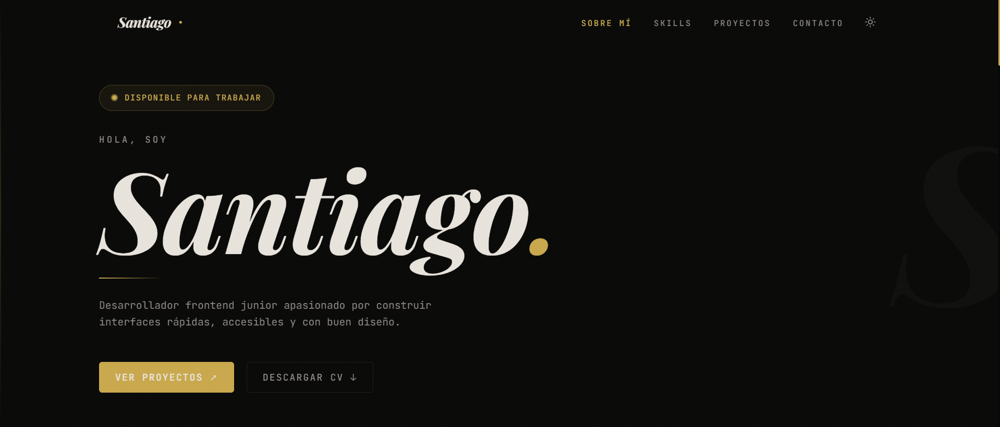

# Portafolio Personal

Sitio web de portafolio personal construido con React 19 + TypeScript + Vite.
Diseño dark/light con acento dorado, animaciones CSS y lazy loading por sección.



## Stack

- React 19 + Vite + TypeScript
- TailwindCSS v4
- Vitest + Testing Library

## Correr en local

```bash
npm install
npm run dev
```

## Scripts

| Comando | Descripción |
|---------|-------------|
| `npm run dev` | Servidor de desarrollo |
| `npm run build` | Build de producción |
| `npm run test` | Ejecutar tests |
| `npm run lint` | Lint del código |
